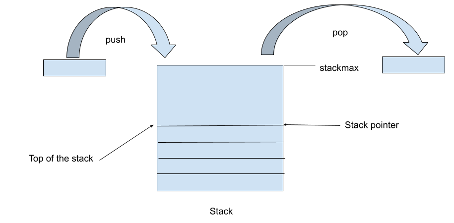

# Ejemplo de TAD

## Problematica

Generalmente cuando trabajamos con una estructura de datos, vamos a estar operando contra valores de estos tipos, accediendo a los datos dentro de estos directamente. De esta manera siempre vamos a tener que conocer como esta compuesto y es posible que tengamos distintos lugares en el codigo que tengamos que utilizar dichas estructuras. 

El problema no se limita a solamente trabajar con las estructuras de datos directamente, sino que en sistemas grandes tener una gran cantidad de estructuras y funciones, puede dificultar un poco el desarrollo, arreglar errores y debuggear por ejemplo. 

Entonces que podemos hacer? Podemos empezar a dividir una gran porcion de codigo en otros mas chicos, de manera de que sean mas mantenibles. Como se logra esto? De varias maneras, iremos viendo de a poco como llegar a eso, al menos para el tema que veremos a continuacion, la idea es que cada pedazo en el que se divide el codigo pueda ser tratado como una herramienta y cuya descripcion o manera de usarlo sea mas simple que el codigo actual. De esa manera uno se puede olvidar de lo que pasa adentro de esa pieza y verse como una caja negra desde afuera.

Esto que acabamos de describir se llama `abstraccion`, y es un concepto bastante interesante que trasciende a traves de los paradigmas incluso de programacion. En esta seccion hablaremos de una abstraccion en particular, de los `tipos abstractos de datos (TAD)`. Estas son estructuras de datos, tipos de datos, cuya implementacion no esta expuesta al usuario final, y todo lo que conoce el usuario son interfaces de operacion sobre estos.

Entonces los TADs tienen un afuera y un adentro, por asi decirlo. El afuera se lo conoce como `interfaz`, que consiste en un conjunto de delcaraciones de tipos y funciones que se necesitan para usar un TAD. La parte interna, dentro de esta caja negra, se lo conoce simplemente como `implementacion`, y consiste en los detalles de implementacion del TAD, junto con otras funciones auxiliares y estructuras adicionales, que no son expuestas al usuario final.

## Hay alternativas al TAD (aka ADT)?

Actualmente, para muchos desarrolladores, existen lenguajes de programacion orientados a objetos en el que existen abstracciones (clases, objetos, herencia) que permiten ocultar los detalles de implementacion al usuario. Desgraciadamente en la cursada al ver C, que es un lenguaje procedural, sin soporte del paradigma de objetos, no tenemos estas caracteristicas ni abstracciones.

Por lo que en este pequeño abstracto veremos como crear un ADT simple, de una estructura de datos que nos puede ayudar para construir otras cosas, y que nos de algunas funciones que nos permitan utilizar dicha estructura de manera facil, sin tener que preocuparse por los pormenores de dicha estructura.

## Ejemplo: Stack

Veamos de implementar un stack simple, que pueda ser creado dinamicamente, y que podamos implementar las funciones mas simples de `push/pop`. Como podemos facilmente implementar esto? simple hagamos primero un `struct stack`, el mismo puede ser simplemente un Array de elementos. Para tener un ejemplo incluso mas facil, hagamos un Stack de `int` solamente, para que el ejemplo sea lo mas chico posible.

Empecemos definiendo la estructura primero

```c
struct stack {
  int Array[?];
}
```

Ok, faltan algunas cosas aun, como el stack pointer, y el Array[] de cuanto deberia ser? Bueno veamos de definirlo a fin de armar la estructura, pensemos un stack size maximo de 256 valores que puedan almarcenarse en cada instancia de stack

```c
/* Maximo tamanio del stack */
#define STACK_MAX_SIZE 256
```

despues de eso, necesitamos en la estructura el stack pointer, para saber en que punto del stack estamos parados, entonces la estructura quedaria de la siguiente manera

```c
/* Stack de integers, con un maximo definido de elementos y un puntero del stack. */
struct Stack_SSL_t {
  int stack_pointer;
  int Array[STACK_MAX_SIZE];
};
```

perfecto, ahora podremos tener un stack similar al que 



agreguemos esto en un archivo `stack.h`, y lo que faltaria serian las operaciones que expondremos al usuario final. La idea final seria que uno pueda utilizar la estructura mediante dichas funciones descritas en el `stack.h` y nada mas. Veamos antes de 

Vamos a ver el caso simple de crear una pila como TAD, antes que nada vamos a definir en el `stack.h` la estructura y las funciones que expondremos para que 

